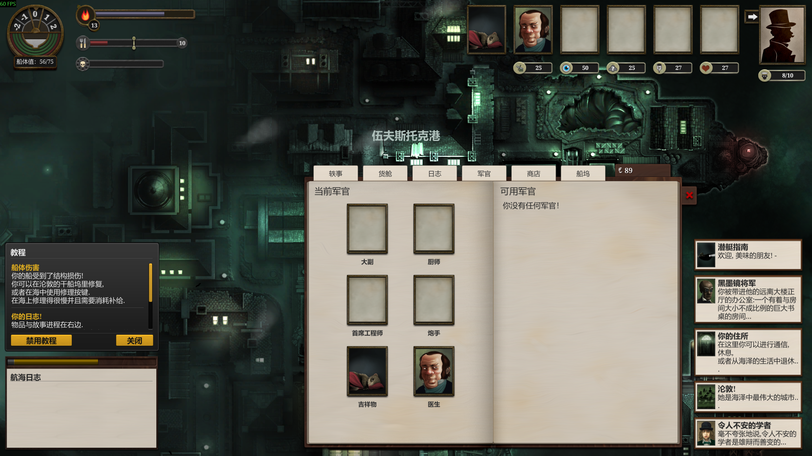

# 《无光之海》Sunless Sea 中文补丁 / Sunless Sea CN Reborn

**Sunless Sea 中文汉化、Chinese localization、BepInEx 文本与 UI 补丁**。本仓库为《Sunless Sea》（中文常译：**无光之海**）制作可安装的社区中文兼容包，包含完整文本 addon、中文 UI 插件，以及 Windows/macOS 一键安装与卸载脚本。

当前兼容包版本：Windows **6.0.4**、macOS **6.0.5**。项目不包含《Sunless Sea》游戏本体或游戏原始资源，使用前请先通过 Steam 等合法渠道拥有并安装游戏。

## 快速下载

从 [GitHub Releases](https://github.com/hsjx945/SunlessSeaCN-Reborn/releases/latest) 下载对应平台的压缩包：

- `SunlessSeaCN-Windows-v6.0.4.zip`：Windows 一键安装、备份、重复安装和卸载恢复。
- `SunlessSeaCN-macOS-v6.0.5.zip`：针对 Unity 6/macOS 的静态 Managed UI 补丁、文本 addon 和一键安装/卸载；安装器只向 Unity 6 当前数据目录安装。

## 汉化实机截图

下面是本项目在 Windows Steam 版上的中文 UI、事件文本和港口界面截图：



## 已验证的游戏版本与兼容范围

下面是本项目实际测试所对应的游戏版本，不要把补丁版本 `6.0.4` 误认为游戏版本号：

本版本对应 [Steam 官方公告《Maintenance update》](https://store.steampowered.com/news/app/304650/view/714534317091455363)（2026 年 7 月 29 日）。公告说明该次更新升级了 Sunless Sea 的 Unity 版本，并修复了部分发售后内容无法正确同步到存档的问题；公告记录的 Steam BuildID 是 `24437295`。本项目正是针对这个更新后的版本制作并完成 Windows 实机验证。

| 项目 | 已验证信息 |
| --- | --- |
| 游戏 | Steam《Sunless Sea》 |
| Steam AppID | `304650` |
| Steam BuildID | `24437295` |
| 可执行文件/Unity | `6000.3.2.11106207` / `6000.3.2f1` |
| Unity 提交标识 | `a9779f353c9b` |
| 操作系统实机测试 | Windows 64-bit；macOS universal Steam app |
| Mod 加载器 | Windows BepInEx `5.4.23.5`；macOS v6.0.5 静态 Managed Bootstrap |
| 中文插件 | `SunlessSeaChineseTranslation 6.0.0` |
| 文本内容 | `Sunless_sea_CN_reborn`，17 个 JSON addon 文件 |
| DLC | Zubmariner（潜艇 DLC）文本随完整 addon 打包；DLC 本身需另购并安装 |

Windows 实机日志已确认 BepInEx 和中文插件正常加载，并应用 Sunless Sea 的 Harmony 补丁。若 Steam 将游戏更新到新的 BuildID 或 Unity 主版本，**不能保证 6.0.4 仍然可用**；遇到插件不加载、启动崩溃或文本失效时，应等待本仓库发布兼容更新。

macOS v6.0.5 绑定同一 BuildID/hash：安装器拒绝不匹配的 `Sunless.Game.dll`，使用 `/usr/bin/bspatch` 临时生成并校验目标文件，再对 app 做 ad-hoc codesign strict verify。macOS 玩家数据目录使用 `~/Library/Application Support/com.failbettergames.sunlesssea`；旧版 `unity.Failbetter Games.Sunless Sea` 不会因为存在旧存档而被优先选中。

## 包含内容

- Windows BepInEx `5.4.23.5`；macOS 使用静态 Managed Bootstrap，避免依赖 macOS 的 BepInEx Doorstop 入口。
- `SunlessSeaChineseTranslation` UI/运行时插件 `6.0.0`。
- `Sunless_sea_CN_reborn` 完整文本 addon，共 17 个 JSON 文件。
- Windows 与 macOS 安装、卸载、备份和重复安装处理。
- 已修复的高优先级文本问题：`Don't panic`、两处 `<i>...</i>` 富文本标签。
- Windows 安装入口已使用 CMD 所需的 CRLF 换行，并修复单一 Steam 路径自动检测时路径被截成首字符的问题。
- 不包含游戏本体、Unity 原始资源或 Steam 文件；安装前必须先安装正版游戏。

## 安装

### Windows

1. 解压 `SunlessSeaCN-Windows-v6.0.4.zip`。
2. 双击 `Install-SunlessSeaCN.cmd`。
3. 启动 Steam 中的 Sunless Sea。

安装器会自动探测常见 Steam 目录，并在覆盖已有文件前创建备份。找不到游戏目录时，可设置 `SUNLESS_SEA_GAME_ROOT`，或直接运行：

```powershell
.\Install-SunlessSeaCN.ps1 -GameRoot "D:\SteamLibrary\steamapps\common\SunlessSea"
```

卸载时双击 `Uninstall-SunlessSeaCN.cmd`，安装器会尝试恢复备份。

### macOS

1. 解压 `SunlessSeaCN-macOS-v6.0.5.zip`。安装包可以放在下载文件夹、桌面或其他本地目录，不需要放进游戏目录。
2. 直接双击 `Install-And-Start-SunlessSeaCN.command`；它会校验游戏 BuildID 对应的 `Sunless.Game.dll`，应用 bsdiff 静态 UI 补丁，把 addon 写入 Unity 6 数据目录，并启动游戏。不需要设置 Steam 启动项。
3. 如果只想安装不启动，双击 `Install-SunlessSeaCN.command`。

脚本会探测 Steam 的 `Sunless Sea.app`。这里的游戏根目录是包含 `Sunless Sea.app` 的 `common/SunlessSea` 文件夹，不是 `Sunless Sea.app/Contents`；Unity 6 数据目录固定优先为 `com.failbettergames.sunlesssea`，不会因 legacy 目录中有旧 saves 而选错。若 Finder 报“无法运行，因为你没有正确的访问权限”，请在解压后的安装包目录执行：

```bash
chmod u+x Install-And-Start-SunlessSeaCN.command Install-And-Start-SunlessSeaCN.sh Install-SunlessSeaCN.command Install-SunlessSeaCN.sh Uninstall-SunlessSeaCN.command Uninstall-SunlessSeaCN.sh
xattr -dr com.apple.quarantine .
./Install-And-Start-SunlessSeaCN.command
```

也可以直接用 `bash Install-And-Start-SunlessSeaCN.sh` 绕过文件执行位问题。不要手动把补丁文件复制到 `.app/Contents`；必须使用安装器，因为它需要生成临时 patched DLL、备份原文件并重签 app。

卸载时双击 `Uninstall-SunlessSeaCN.command`。必要时可只对游戏目录移除隔离属性：

```bash
xattr -dr com.apple.quarantine "$HOME/Library/Application Support/Steam/steamapps/common/SunlessSea"
```

## 常见问题

### Sunless Sea 有中文吗？

本仓库提供《Sunless Sea／无光之海》的社区中文补丁，覆盖 UI 和主要游戏文本；从 Releases 下载对应平台安装包即可。

### 能不能不用设置，点击一个文件就完成？

可以。macOS v6.0.5 解压后双击 `Install-And-Start-SunlessSeaCN.command`，会自动校验并安装静态补丁、文本 addon，然后打开游戏，不需要设置 Steam 启动项。macOS 对未签名的下载文件仍可能显示一次系统安全确认，这是系统的正常保护提示。

### Sunless Sea 汉化支持哪个版本？

当前明确验证的是 Steam AppID `304650`、BuildID `24437295`、Unity `6000.3.2f1`（Unity 内部版本 `6000.3.2.11106207`）。其他 BuildID 可能可以运行，但不属于本版的实机验证范围。

### 支持 Zubmariner 潜艇 DLC 吗？

支持。完整文本 addon 按包含 Zubmariner 内容的游戏数据整理，潜艇 DLC 的文本在汉化范围内；DLC 本身仍需玩家在 Steam 购买并安装。

### Windows 和 macOS 都能用吗？

Windows 已在上述 Steam 版本上完成实机启动和插件加载验证。macOS v6.0.5 提供 universal 安装包和卸载脚本；它只支持本版本的 Unity 6 Mono Managed DLL hash。

### 这是《Sunless Sea》游戏本体吗？

不是。这是汉化/本地化兼容包，只分发补丁、Mod 加载器、文本 addon 和安装脚本，不分发游戏本体或原始资源。

## 搜索关键词 / Search keywords

为了方便中文玩家和英文玩家找到本项目，以下名称均指向同一个游戏或本仓库：

`Sunless Sea 中文补丁` · `Sunless Sea 汉化` · `无光之海 汉化` · `无光之海 中文` · `Sunless Sea Chinese` · `Sunless Sea Chinese translation` · `Sunless Sea localization` · `Sunless Sea CN` · `SunlessSeaCN` · `BepInEx Sunless Sea` · `Zubmariner 中文` · `Sunless Sea Windows patch` · `Sunless Sea macOS patch` · `Steam Sunless Sea mod`

## 测试记录

- Windows 临时目录：安装、重复安装、备份、卸载恢复通过。
- Windows Steam 实机：游戏启动后日志确认 BepInEx `5.4.23.5`、中文插件 `6.0.0` 加载并应用 Harmony。
- macOS：Bash 3.2 安装/重复安装/卸载/失败回滚沙箱通过；ZIP 保留脚本 755 权限，包含 17 个 addon JSON，不包含完整 `Sunless.Game.dll`。
- macOS：static Managed patch 已在真实 Steam app 成功加载 UI Harmony 与正确 Unity 6 数据根；Steam BuildID/hash 变更时安装器会安全拒绝。

## 参考与致谢

### 致谢前人汉化

特别感谢前人的汉化工作：本项目**不是从零开始翻译，也不把第三方汉化文本或 UI 翻译称为原创**。本项目作者主要负责当前版本的兼容性核对、格式/标签修复、BepInEx 运行环境整理、Windows/macOS 安装器、打包和测试，并将已有成果整合成可安装的 `Sunless Sea CN Reborn` 兼容包。

感谢 [tinygrox/SunlessSeaCN](https://github.com/tinygrox/SunlessSeaCN) 提供 UI 中文插件方向和运行时兼容基础，感谢 [InstantComet/SunlessSea](https://github.com/InstantComet/SunlessSea) 及其 README 所列的 [diskrubbish 前身项目](https://github.com/diskrubbish/Sunless_Sea_Chinese_Translation_Mod_Re) 提供文本汉化基础。请以这些上游项目的作者署名、许可证和最新说明为准。

本仓库原创部分主要是兼容性整理、安装/卸载脚本、打包脚本、测试记录和说明文档。

- UI 插件参考：[tinygrox/SunlessSeaCN](https://github.com/tinygrox/SunlessSeaCN)。该项目 README 说明其为 UI 中文补丁，并注明部分翻译参考 Instant Comet；仓库包含 GPL-3.0 LICENSE，同时 README 写有 CC-BY 4.0 说明，因此请以其仓库中的最新许可证和作者说明为准。
- 文本 addon 参考：[InstantComet/SunlessSea](https://github.com/InstantComet/SunlessSea)，其 README 说明这是文本汉化项目，并列出 [diskrubbish 的前身项目](https://github.com/diskrubbish/Sunless_Sea_Chinese_Translation_Mod_Re)。该仓库当前未发现独立 LICENSE 文件，原作者署名应保留。
- Mod 加载器使用 [BepInEx 5.4.23.5](https://github.com/BepInEx/BepInEx/releases/tag/v5.4.23.5)，其许可证和源码以官方仓库为准。
- 游戏版权归 Failbetter Games 及相关权利人所有。本项目与 Failbetter Games 无关。

详见 [`THIRD-PARTY-NOTICES.md`](THIRD-PARTY-NOTICES.md)。

## 许可证范围

本仓库原创的打包脚本、安装/卸载脚本和说明文档使用 [`LICENSE-ORIGINAL.txt`](LICENSE-ORIGINAL.txt)。第三方插件、BepInEx 和汉化文本不适用该许可证，分别受其上游条款约束。
